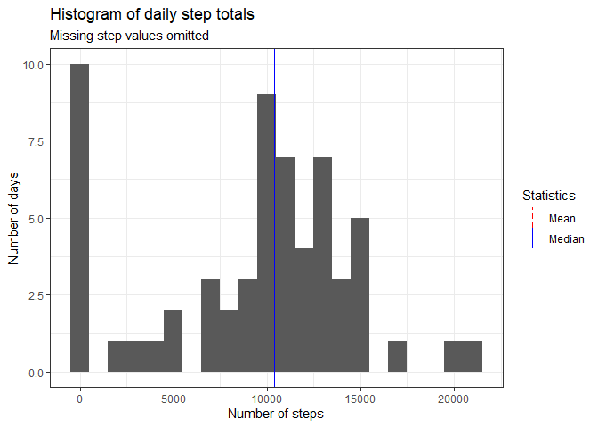
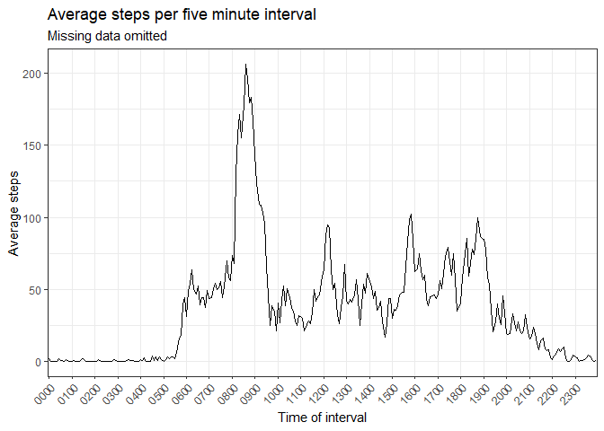
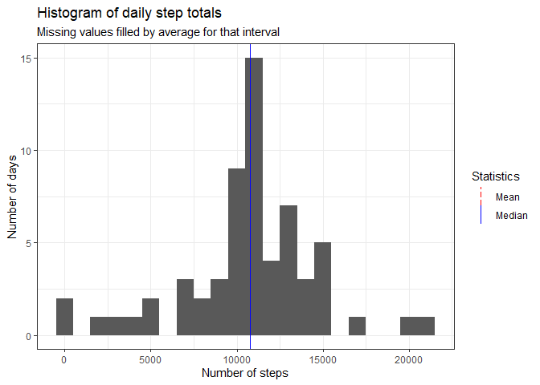
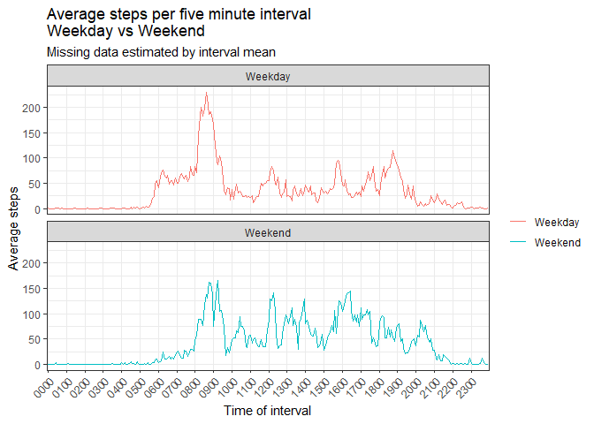

## Loading and preprocessing the data

The raw data as provided is a csv file, which is loaded using the tidyverse 
function `read_csv`.  Defaults are sufficient as this data set uses standard 
separators (',') and string 'NA' for missing values.  


```r
library(tidyverse)
rawActy <- read_csv('activity.csv')
```

Inspection of the data shows the three variables: steps, data and interval.  The 
first 20 entries are shown:


```r
rawActy[seq(1,20),]
```

```
## # A tibble: 20 x 3
##    steps date       interval
##    <dbl> <date>        <dbl>
##  1    NA 2012-10-01        0
##  2    NA 2012-10-01        5
##  3    NA 2012-10-01       10
##  4    NA 2012-10-01       15
##  5    NA 2012-10-01       20
##  6    NA 2012-10-01       25
##  7    NA 2012-10-01       30
##  8    NA 2012-10-01       35
##  9    NA 2012-10-01       40
## 10    NA 2012-10-01       45
## 11    NA 2012-10-01       50
## 12    NA 2012-10-01       55
## 13    NA 2012-10-01      100
## 14    NA 2012-10-01      105
## 15    NA 2012-10-01      110
## 16    NA 2012-10-01      115
## 17    NA 2012-10-01      120
## 18    NA 2012-10-01      125
## 19    NA 2012-10-01      130
## 20    NA 2012-10-01      135
```
This shows the unusual format of the 'interval' variable, which codes the time 
of the 5-minute interval as HHMM (24 hour), and then has been converted to an 
integer thereby stripping the leading zeros.  (Particularly note the consecutive 
interval values of 55 and 100 - corresponding to 0055 and 0100 respectively.)

We use the following to transform this:

```r
leadingZeros <- mapply(function(x, y) paste0(rep(x, y), collapse = ""), 
                       0, 4 - nchar(rawActy$interval))
rawActy[,'interval.HM'] <- paste0(leadingZeros, rawActy$interval)
```
producing:

```r
rawActy[seq(1,20),]
```

```
## # A tibble: 20 x 4
##    steps date       interval interval.HM
##    <dbl> <date>        <dbl> <chr>      
##  1    NA 2012-10-01        0 0000       
##  2    NA 2012-10-01        5 0005       
##  3    NA 2012-10-01       10 0010       
##  4    NA 2012-10-01       15 0015       
##  5    NA 2012-10-01       20 0020       
##  6    NA 2012-10-01       25 0025       
##  7    NA 2012-10-01       30 0030       
##  8    NA 2012-10-01       35 0035       
##  9    NA 2012-10-01       40 0040       
## 10    NA 2012-10-01       45 0045       
## 11    NA 2012-10-01       50 0050       
## 12    NA 2012-10-01       55 0055       
## 13    NA 2012-10-01      100 0100       
## 14    NA 2012-10-01      105 0105       
## 15    NA 2012-10-01      110 0110       
## 16    NA 2012-10-01      115 0115       
## 17    NA 2012-10-01      120 0120       
## 18    NA 2012-10-01      125 0125       
## 19    NA 2012-10-01      130 0130       
## 20    NA 2012-10-01      135 0135
```

The data is now preprocessed and ready for use.

## What is mean total number of steps taken per day?

From above we can see there are missing values.  Before we deal with those, 
we can inspect the distribution of the total number of steps per day over the 
61 days of data.  Visually, we can do this using a bar histogram.  It is 
strightforward to also plot the mean and median values.  

First, calculate the mean and median values for total steps per day.

```r
stepsPerDay_rmNA <- rawActy %>% 
                    group_by(date) %>% 
                    summarise(daily.steps = sum(steps, na.rm=TRUE))

meanStepsDay_rmNA <- summary(stepsPerDay_rmNA$daily.steps)[['Mean']]
medianStepsDay_rmNA <- summary(stepsPerDay_rmNA$daily.steps)[['Median']]
```
Now plot the histogram using ggplot2.  (Note, the `ggplot2` library is loaded 
when `tidyverse` is.)

```r
stepsPerDay_rmNA %>%
    ggplot(aes(daily.steps)) + 
        geom_histogram(binwidth=1000) + 
        theme_bw() +
        labs(title='Histogram of daily step totals', 
             subtitle='Missing step values omitted') +
        labs(x='Number of steps', y='Number of days') + 
        geom_vline(aes(xintercept=meanStepsDay_rmNA, 
                       color='Mean', linetype='Mean')) + 
        geom_vline(aes(xintercept=medianStepsDay_rmNA, 
                       color='Median', linetype='Median')) + 
        scale_color_manual(name='Statistics', 
                           values=c(Mean='red', Median='blue')) +
        scale_linetype_manual(name='Statistics', 
                              values=c(Mean=5, Median=1))
```

<!-- -->

## What is the average daily activity pattern?

We can examine the mean number of steps taken each over five-minute interval.  
Again we remove missing values and not attempt any replacement.  


```r
# Calculate the mean number of steps per interval - removing NA values
meanStepPerInterval_rmNA <- rawActy %>% 
                            group_by(interval.HM) %>% 
                                summarise(average.steps.interval = 
                                              mean(steps, na.rm=TRUE))

# Plot the mean number of steps per interval as a time-series line graph
# Extract labels for each hour to insert on x-axis
timeTicks <- meanStepPerInterval_rmNA$interval.HM[seq(1,288,by=12)]

meanStepPerInterval_rmNA %>% 
    ggplot(aes(interval.HM, average.steps.interval, group=1)) + 
        geom_line() + 
        theme_bw() +
        scale_x_discrete(breaks=timeTicks) + 
        theme(axis.text.x = element_text(angle = 45, hjust = 1)) + 
        labs(title = 'Average steps per five minute interval', 
             subtitle = 'Missing data omitted') +
        labs(x = 'Time of interval', y = 'Average steps')
```

<!-- -->

To determine the interval with the maximum mean number of steps, we can first 
find the index that the maximumn occurs at, then look up the time.  


```r
indexMax <- which.max(meanStepPerInterval_rmNA$average.steps.interval)
intervalMaxAve_rmNA <- meanStepPerInterval_rmNA[indexMax,]$interval.HM
```
We can see that the maximum occurs at **0835** with an average of 
206.2 steps.  

## Imputing missing values

To calculate the number of step values missing (that is, are NA) the following 
R code can be used.


```r
missingStepValues <- is.na(rawActy$steps)
numMissingSteps <- sum(missingStepValues)
```
Based on this, we observe that there are **2304** missing values for 
count of steps.  

The strategy for dealing with these will be to replace missing values with the 
mean value for that interval, as calculated for the days that the corresponding 
value was present.  

First we create an R object that copies the raw data.  This is done as we may 
want to return to the original data and the missing values.  Note that we use 
the `data.table::copy()` function.  If we were to assign a new variable to the 
existing data, it would point to the same object and any changes are therefore 
made to the original data.  

```r
fillRawActy <- data.table::copy(rawActy)
```

Before we use the mean values for steps per interval, we make sure there are 
no NA values in that data, which could have occurred if there was no data 
captured for that interval on any day. 


```r
### First make sure the average steps per interval doesn't have missing values
### Replace by 0 if it is missing
noMeanSteps <- is.na(meanStepPerInterval_rmNA$average.steps.interval)
meanStepPerInterval_rmNA[noMeanSteps, 'average.steps.interval'] <- 0
```

Now we can work through the indexes captured in `missingStepValues`, and recover 
the time interval they occurred and replace with the mean for that time interval.


```r
for (i in seq_along(missingStepValues)){
    if (missingStepValues[i]){  # Missing a step value so replace with mean 
        missTimeInter <- fillRawActy[[i, 'interval.HM']]
        fillRawActy[i, 'steps'] <- 
            meanStepPerInterval_rmNA[
                meanStepPerInterval_rmNA$interval.HM ==  missTimeInter,]$average.steps.interval

    }
}
```

We now repeat the earlier exercise of generating a histogram of the distribution 
of total daily steps, now with values imputed for the missing values.  


```r
stepsPerDayFill <- fillRawActy %>% 
    group_by(date) %>% 
    summarise(daily.steps = sum(steps, na.rm=TRUE)) 

# Mean and median steps per day (ignoring missing data)
# Use these on histogram and include in markdown report
meanStepsDayFill <- summary(stepsPerDayFill$daily.steps)[['Mean']]
medianStepsDayFill <- summary(stepsPerDayFill$daily.steps)[['Median']]


# Plot the histogram showing distribution of number of steps per day
# Add reference lines for mean and median and add color and line styles
stepsPerDayFill %>%
    ggplot(aes(daily.steps)) + 
    geom_histogram(binwidth=1000) + 
    theme_bw() +
    labs(title='Histogram of daily step totals', 
         subtitle='Missing values filled by average for that interval') +
    labs(x='Number of steps', y='Number of days') + 
    geom_vline(aes(xintercept=meanStepsDayFill, 
                   color='Mean', linetype='Mean')) + 
    geom_vline(aes(xintercept=medianStepsDayFill, 
                   color='Median', linetype='Median')) + 
    scale_color_manual(name='Statistics', 
                       values=c(Mean='red', Median='blue')) +
    scale_linetype_manual(name='Statistics', 
                          values=c(Mean=5, Median=1))
```

<!-- -->

We can compare the mean and median for total daily steps before and after 
imputing missing values.  First, convert them to a 'prettier format':

```r
meanSR <- format(meanStepsDay_rmNA, digits=3, nsmall=1)
medSR <- format(medianStepsDay_rmNA, digits=3, nsmall=1)
meanSF <- format(meanStepsDayFill, digits=3, nsmall=1)
medSF <- format(medianStepsDayFill, digits=3, nsmall=1)
```

|         | Mean                   |     Median              |
|---------|------------------------|-------------------------|
| With missing values  |9354.2   | 10395.0 |
| After imputing values   |10766.2    | 10766.2    |

We see that after imputing missing values both the mean and median have 
increased.  Further, the mean and median now have the same value.  

## Are there differences in activity patterns between weekdays and weekends?

Finally, we visually compare the daily activity pattern between weekdays and 
weekends (as determined by the mean number of steps per five-minute interval).

First, determine which days are weekdays and which are weekends, and add to 
the dataset where the missing values have been imputed.  The function 
`weekdays()` is used.  


```r
fillRawActy <- mutate(fillRawActy, 
       week.factor = as.factor(if_else(weekdays(date, abbreviate = TRUE) %in% c('Sat', 'Sun'), 
                                 'Weekend',
                                 'Weekday')))
```

Observe the count of this variable, which has class 'factor'.

```r
table(fillRawActy$week.factor)
```

```
## 
## Weekday Weekend 
##   12960    4608
```

We now use this factor to group the data, in addition to the interval, and 
calculate averages, and then plot using ggplot's `facet_wrap` function.  


```r
avgSteps_interWeekpart <- 
    fillRawActy %>% 
        group_by(week.factor, interval.HM) %>%  
            summarise(avg.steps = mean(steps))

avgSteps_interWeekpart %>% 
    ggplot(aes(interval.HM, avg.steps, color=week.factor, group=1)) +
        facet_wrap( ~ week.factor, ncol=1 ) +
        geom_line() + 
        theme_bw() +
        scale_x_discrete(breaks=timeTicks) + 
        theme(axis.text.x = element_text(angle = 45, hjust = 1)) + 
        labs(title = 'Average steps per five minute interval\nWeekday vs Weekend', 
             subtitle = 'Missing data estimated by interval mean') +
        labs(x = 'Time of interval', y = 'Average steps') + 
        labs(color=NULL) # this removes legend title 
```

<!-- -->

Based on this visualisation, we can suggest at least one hypothesis, in 
that our subject appears to be active earlier on weekdays than on weekends.
